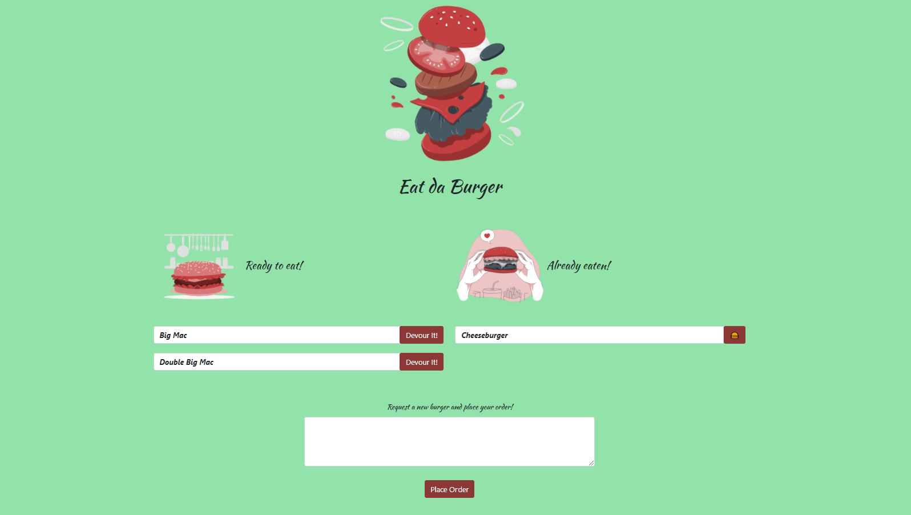

<h1 align="center">🍔Eat Da Burger!</h1>

 

## Description 
A Node, Express, Handlebars, and MySQL burger app that lets users input the names of burgers they'd like to eat... and then devour them! Please check out the launched app on Heroku [here](https://)!

## ✨Demo

 ## Table of Contents
* [How the app works](#Description)
* [Description](#Description)
* [Installation](#installation)
* [Usage](#usage)
* [license](#license)

## How the app works
This project is a full stack application that allows you to place an order for a burger. When you place an order, the burger you enter in the form field is added to the list of burgers on the left side of the screen. Each burger in the list has a Devour me button. Clicking this button moves the burger from the list on the left side of the screen to the list on the right. The list on the right is a list of burgers that have already been devoured. Each burger in this list has a Throw away button that allows you to remove the burger, which deletes the burger from the user interface as well as from the MySQL database.

## Installation
*Steps required to install project and how to get the development environment running:*

    1-Download or clone this repository into your local computer.
    2-npm init
    3-Install the dependencies
    4-Install MySQL Workbench
    5-Set up a development database

## 💻usage
*Instructions and examples for use:*  

 Application will be invoked by using the following command:

    node server.js
    
## Features

    Bootstrap - CSS framework 
    JavaScript library 
    Express - Node Framework 
    Heroku - Used to deploy application

## 📝License
MIT License 
       

## Questions
 :octocat: Find me on GitHub:[shiva-shiva](https://github.com/shiva-shiva) 
     
    ✉️ Email me with any questions: shivasabokdast@gmail.com  